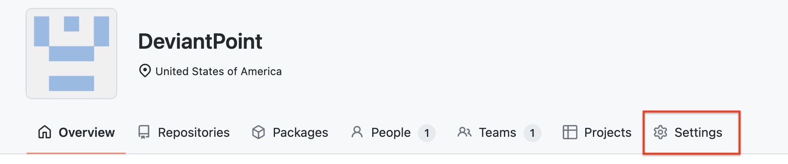
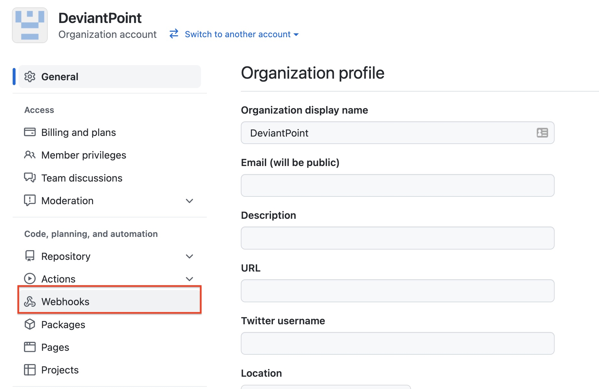
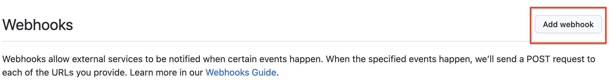
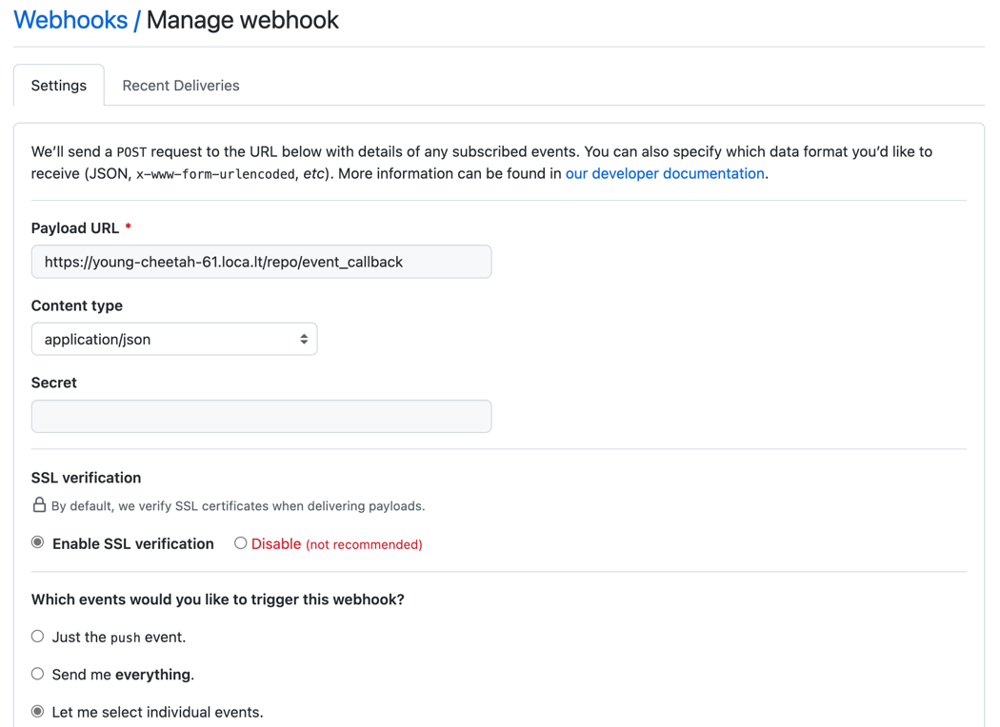

# Github Protected Branch Settings Service

## Overview

This is the repository for a java-based REST service that adds [branch protection rules](https://docs.github.com/en/repositories/configuring-branches-and-merges-in-your-repository/defining-the-mergeability-of-pull-requests/about-protected-branches)
to a Github repository. Branch protection rules allows you to define rules for your important repository branches that
govern who can push to or delete branches, if pull requests and/or status checks are required, and other settings.

### Use Cases

The service supports the following use cases:

1. Automatically configure protected branch settings for all new repositories created in a Github organization.
2. Retroactively apply protected branch settings to existing repositories in a Github organization.

The default branch protection rules that this service applies can be found [here](./src/main/resources/repo_protection_template.json).
This can be overridden with an environment variable.

### Endpoints

The service has two primary endpoints (OpenAPI definition for this service can be found at `{service-url}/swagger-ui.html`):

* **/repo/event_callback**
  * This can receive Github webhook `repo` events and if the type is `created`, the service will:
    * Protect the default branch
    * Add a new issue to the repo tagging users and teams to the branch protection rules applied
    * **Note:** If a repository is empty when first created, Github will not create a default branch.
    Therefore, branch protection rules would not be applied. To ensure that all new repos have a protected
    branch, this endpoint will add a default [README.md](src/main/resources/repo_default_readme.md) file to empty repositories.
* **/repo/protect**
   * This is used primarily for applying branch protection settings to existing repos. See [Protecting Existing Repos](#uc2-protecting-existing-repos) for its use.
   
## Getting Started

### Running the Service

This service can be immediately deployed as a **Docker** container or to **Kubernetes**.
Each approach is described in subsequent sections.

Before deploying the service, the following prerequisites should be met.

#### Prerequisites

##### A. Personal Access Token

Before deploying the service, a Github personal access token is required.
[Create one now](https://docs.github.com/en/authentication/keeping-your-account-and-data-secure/creating-a-personal-access-token).

##### B. Environment Variables

To deploy using the Docker or Kubernetes examples below, first set the following environment variables in your shell,
replacing `<YOUR TOKEN>` with the Github personal access token created earlier
and `<USERS_TO_ALERT>` with a list of users and/or teams to alert (e.g, `@bxtp4p,@deviantpoint/demo_team`):

```shell
export GH_API_TOKEN=<YOUR_TOKEN>
export ALERT_USERS=<USERS_TO_ALERT>
```

#### Docker

1. Set the environment variables as described in [Environment Variables](#b-environment-variables). Then run the following commands to run this service in a Docker container:

    ```shell
    docker run --name protected-branch-settings-service -d -p 8080:8080 -e GH_API_TOKEN=${GH_API_TOKEN} -e ALERT_USERS=${ALERT_USERS} bxtp4p/protected-branch-settings
    ```

1. Logs can be viewed as follows:

   ```shell
   $ docker logs -f protected-branch-settings-service
   Setting Active Processor Count to 8
   Calculating JVM memory based on 9053452K available memory
   Calculated JVM Memory Configuration: -XX:MaxDirectMemorySize=10M -Xmx8456514K -XX:MaxMetaspaceSize=84937K -XX:ReservedCodeCacheSize=240M -Xss1M (Total Memory: 9053452K, Thread Count: 250, Loaded Class Count: 12582, Headroom: 0%)
   Enabling Java Native Memory Tracking
   Adding 128 container CA certificates to JVM truststore
   Spring Cloud Bindings Enabled
   Picked up JAVA_TOOL_OPTIONS: -Djava.security.properties=/layers/paketo-buildpacks_bellsoft-liberica/java-security-properties/java-security.properties -XX:+ExitOnOutOfMemoryError -XX:ActiveProcessorCount=8 -XX:MaxDirectMemorySize=10M -Xmx8456514K -XX:MaxMetaspaceSize=84937K -XX:ReservedCodeCacheSize=240M -Xss1M -XX:+UnlockDiagnosticVMOptions -XX:NativeMemoryTracking=summary -XX:+PrintNMTStatistics -Dorg.springframework.cloud.bindings.boot.enable=true

   .   ____          _            __ _ _
   /\\ / ___'_ __ _ _(_)_ __  __ _ \ \ \ \
   ( ( )\___ | '_ | '_| | '_ \/ _` | \ \ \ \
   \\/  ___)| |_)| | | | | || (_| |  ) ) ) )
   '  |____| .__|_| |_|_| |_\__, | / / / /
   =========|_|==============|___/=/_/_/_/
   :: Spring Boot ::                (v2.6.3)

   2022-02-08 03:36:26.992  INFO 1 --- [           main] c.t.g.GithubRepoEventsHandlerApplication : Starting GithubRepoEventsHandlerApplication v0.0.1-SNAPSHOT using Java 11.0.14 on d2aae8ae49ab with PID 1 (/workspace/BOOT-INF/classes started by cnb in /workspace)
   2022-02-08 03:36:27.001  INFO 1 --- [           main] c.t.g.GithubRepoEventsHandlerApplication : No active profile set, falling back to default profiles: default
   2022-02-08 03:36:29.792  INFO 1 --- [           main] o.s.b.w.embedded.tomcat.TomcatWebServer  : Tomcat initialized with port(s): 8080 (http)
   2022-02-08 03:36:29.823  INFO 1 --- [           main] o.apache.catalina.core.StandardService   : Starting service [Tomcat]
   2022-02-08 03:36:29.824  INFO 1 --- [           main] org.apache.catalina.core.StandardEngine  : Starting Servlet engine: [Apache Tomcat/9.0.56]
   2022-02-08 03:36:29.991  INFO 1 --- [           main] o.a.c.c.C.[Tomcat].[localhost].[/]       : Initializing Spring embedded WebApplicationContext
   2022-02-08 03:36:29.992  INFO 1 --- [           main] w.s.c.ServletWebServerApplicationContext : Root WebApplicationContext: initialization completed in 2805 ms
   2022-02-08 03:36:31.143  INFO 1 --- [           main] o.s.b.w.embedded.tomcat.TomcatWebServer  : Tomcat started on port(s): 8080 (http) with context path ''
   2022-02-08 03:36:31.164  INFO 1 --- [           main] c.t.g.GithubRepoEventsHandlerApplication : Started GithubRepoEventsHandlerApplication in 5.729 seconds (JVM running for 6.603)
   ```

1. The service should now be available on port 8080 (e.g., <http://localhost:8080>).
1. Proceed to [configuring the webhook](#uc1-github-webhook-configuration-and-usage).

#### Kubernetes

The Kubernetes resource manifest files can be found [here](./deployment/kubernetes).
To deploy them, follow these steps:

1. Open a terminal and set up your [environment variables](#b-environment-variables).
1. [Clone](https://docs.github.com/en/repositories/creating-and-managing-repositories/cloning-a-repository) this repo and navigate to this project's root directory.
1. Run the following commands to create a Kubernetes Secret and ConfigMap containing the values from the environment variables:

   ```shell
   $ kubectl create secret generic gh-api-secret --from-literal=api_token=${GH_API_TOKEN}
   secret/gh-api-secret created
   $ kubectl create configmap alert-users-config --from-literal=alert_users=${ALERT_USERS}
   configmap/alert-users-config created
   ```

1. Now, you can create the deployment and service from the resource manifest files:

   ```shell
   $ cat ./deployment/kubernetes/*.yaml | kubectl apply -f -
   deployment.apps/protected-branch-settings created
   service/protected-branch-settings created
   ```

1. After a few moments, the pod should be running.
   Check to see the status of the pod is `Running`:

   ```shell
   $ kubectl get pod
   NAME                                         READY   STATUS    RESTARTS   AGE
   protected-branch-settings-5c466cd749-9g82h   1/1     Running   0          8s
   ```

   The service should now be available on port 8080 on the nodes Kubernetes scheduled the pods on.

1. Proceed to [configuring the webhook](#uc1-github-webhook-configuration-and-usage).

## Use Case Implementation Instructions
### UC1: Github Webhook Configuration and Usage

In order to use this service to automatically add branch protection rules to newly created repos,
you must configure the following in the Github [Organization](https://docs.github.com/en/organizations) you want to enable this for.

#### Configuration steps

1. Navigate to your organization's settings page:

1. Navigate to Webhook settings:

1. Add a new webhook

1. In the Add webhook form, apply the following configuration (leave everything else to their default values):
   1. Payload URL: `{Protected Branch Settings Service URL}/repo/event_callback`
      * **Note:** This address needs to be publicly accessible. In the screenshot below,
            [Local Tunnel](https://github.com/localtunnel/localtunnel) is used to open a tunnel
            to allow the webhook data to be sent to the service container that wouldn't otherwise
            be available publicly.
   1. Content type: `application/json`
   1. Events:
      1. Check: `Repositories`
      1. Uncheck: `Pushes`


#### Using the Webhook

After the webhook is created, you can [create a new repository](https://docs.github.com/en/repositories/creating-and-managing-repositories/creating-a-new-repository) to test if the branch protection rules are applied correctly.

### UC2: Protecting Existing Repos

If you already have existing repos in your org you'd like to protect,
you can use the `/repo/protect` endpoint to do so. This endpoint
expects an array of strings containing the full repo names to protect.

For example, this curl command tries to protect two repositories, `deviantpoint/demo` and `deviantpoint/repo2`:

```shell
curl -X POST http://localhost:8080/repo/protect \
   -H 'Content-Type: application/json' \
   -d '["deviantpoint/demo", "deviantpoint/repo2"]'
```

## Advanced Configuration 

The service supports additional environment variables in addition to the `GH_API_TOKEN` and `ALERT_USERS` environment variables
used earlier. The full list of environment variables are described in the table below.

| Environment Variable          | Description                                                                                                                                           | 
|-------------------------------|-------------------------------------------------------------------------------------------------------------------------------------------------------|
| GH_API_TOKEN                  | The personal access token used to connect to the Github API.                                                                                          |
| ALERT_USERS                   | The users and teams to tag in the repo issue created to document the protection rules applied.                                                        |
| REPO_PROTECTION_TEMPLATE_FILE | The file to use to replace the [default protection rules](./src/main/resources/repo_protection_template.json) file.                                   |
| REPO_ISSUE_BODY_TEMPLATE_FILE | The template file to use to output the body of the issue created. Replaces this [default](src/main/resources/repo_protection_issue.md).               |
| REPO_DEFAULT_README_FILE      | The template file to use for the default `README` file that is optionally created. Replaces this [default](src/main/resources/repo_default_readme.md) | 

For example, to run this service using an alternate set of protection rules, you can run something like:

```shell
docker run --name protected-branch-settings-service -d -p 8080:8080 -v /opt/test/repo_protection_template_alternate.json:/opt/data/alternate.json -e GH_API_TOKEN=${GH_API_TOKEN} -e ALERT_USERS=${ALERT_USERS} -e REPO_PROTECTION_TEMPLATE_FILE=/opt/data/alternate.json bxtp4p/protected-branch-settings
```

This will mount the contents of the `/opt/test/repo_protection_template_alternate.json` file into `/opt/data/alternate.json` of the container.
And the `REPO_PROTECTION_TEMPLATE_FILE` environment variable is then used to use the alernate file. 